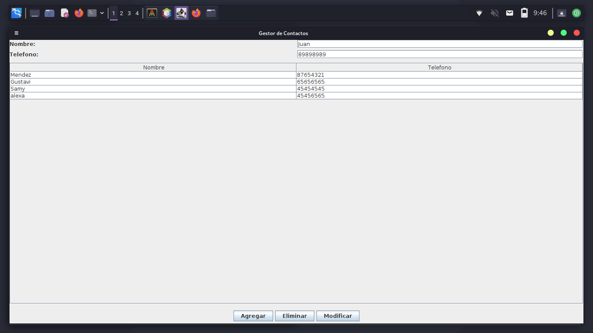
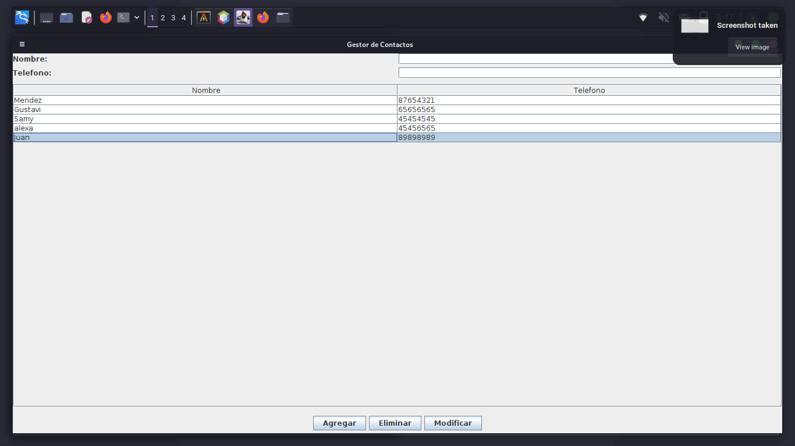
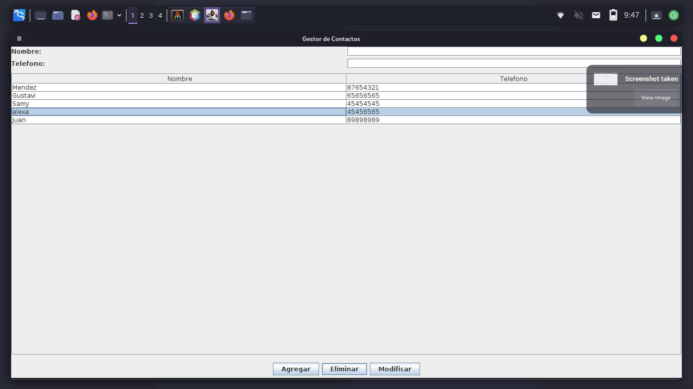
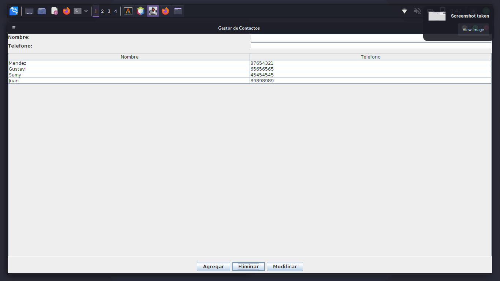
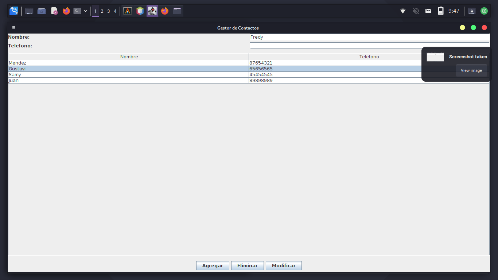
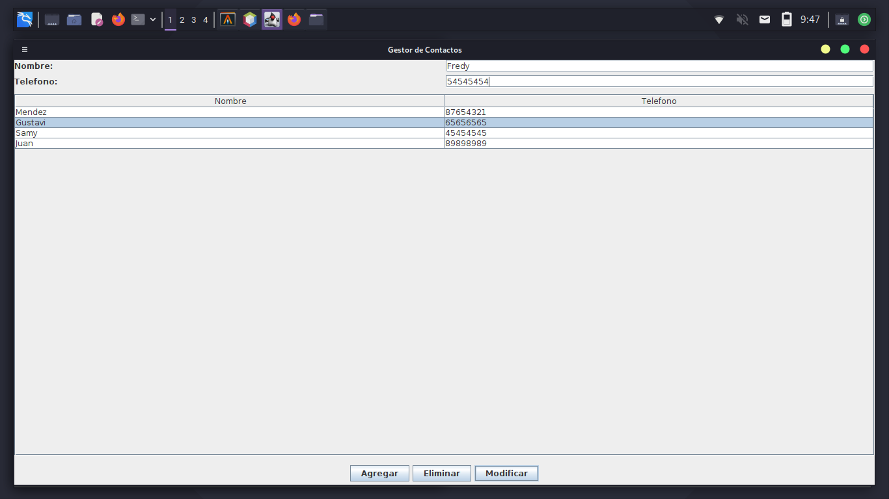
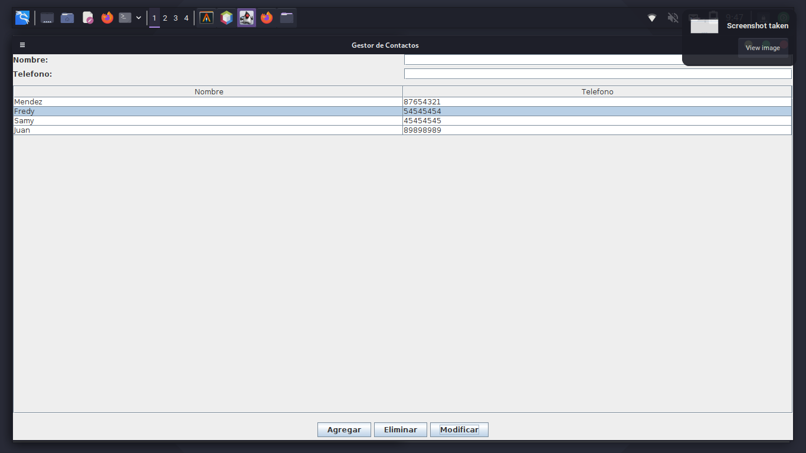

# 📇 Gestor de Contactos en Java (Swing + Archivos)

Una aplicación de escritorio desarrollada en **Java Swing** que permite **gestionar una lista de contactos**.  
El programa ofrece una interfaz gráfica sencilla para **agregar, modificar, eliminar y visualizar contactos**, con persistencia de datos en un archivo de texto (`contactos.txt`).

---

## 🚀 Características
- **Interfaz gráfica (Swing)** intuitiva.
- **Gestión de contactos**:
  - ➕ Agregar un nuevo contacto.
  - 📝 Modificar un contacto existente.
  - ❌ Eliminar contactos seleccionados.
  - 📋 Visualizar todos los contactos en una tabla.
- **Persistencia de datos**:
  - Los contactos se guardan automáticamente en un archivo `contactos.txt`.
  - Al iniciar, los contactos se cargan desde el archivo.

---

## 🛠️ Tecnologías utilizadas
- **Lenguaje:** Java 8+  
- **Interfaz gráfica:** Swing (`JFrame`, `JPanel`, `JTable`, `JButton`, etc.)  
- **Manejo de archivos:** `BufferedReader` y `BufferedWriter`  

---

## ▶️ Ejecución de la aplicación

1. **Clonar el repositorio:**
   ```bash
   git clone https://github.com/FredyGus/Gestor-De-Contactos.git
   cd Gestor-De-Contactos
   
2. **Si se usa Maven**
   ```
   mvn clean package
   
   ```
   **O directamente**
   ```
   javac src/main/java/com/gestor/gestordecontactos/*.java -d out
   
   ```
3. **Ejecutar la aplicacion**
   ```
   java -cp out com.gestor.gestordecontactos.GestorDeContactos

   ```
  
## 📸 Capturas de Pantalla

### 🖼️ Interfaz Principal


### ➕ Agregar Contacto




### ❌ Eliminar Contacto




### 📝 Modificar Contacto



